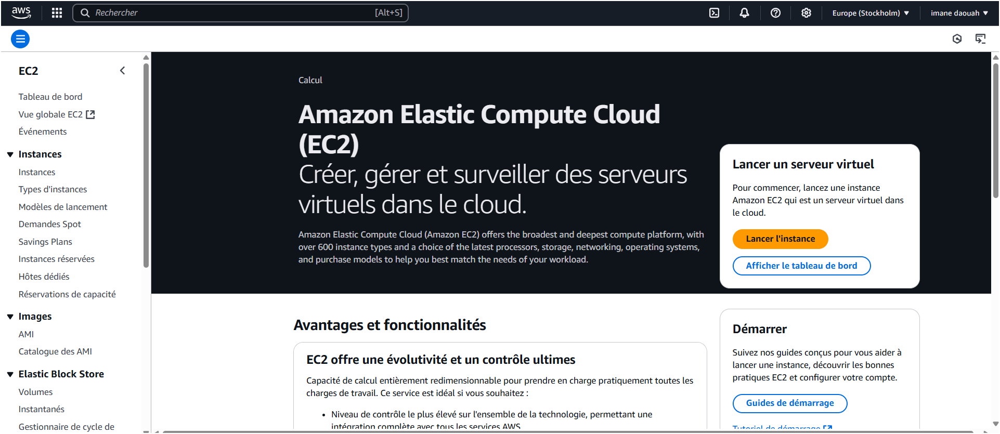
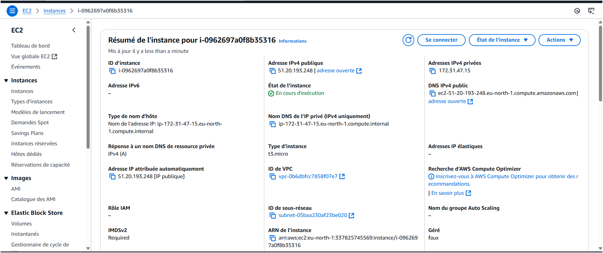
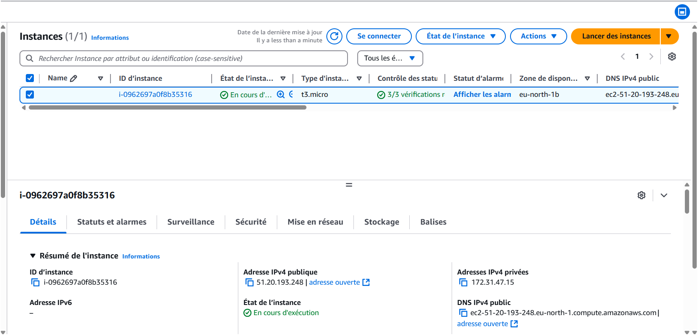

📦 Mini-Projet Docker : Conteneurisation d'une Application Flask + PHP

📌 Étape I : Construire et tester l'API 

Dans cette partie, nous allons construire et tester l’API Flask en suivant plusieurs étapes.

Objectif :

Nous avons utilisé l’image python:3.8-buster comme base pour notre conteneur.
Ajout des informations du mainteneur
Nous avons ajouté notre nom et email dans le Dockerfile avec LABEL maintainer.


 Objectif :

Nous avons configuré le conteneur pour exposer le port 5000 afin d’accéder à l’API Flask.
Construction et lancement de l’image Docker 
Nous avons construit l’image avec la commande :
docker build -t student_api .


Puis, nous avons lancé un conteneur avec :
docker run -d -p 5000:5000 -v $(pwd)/student_age.json:/data/student_age.json --name api student_api


 Objectif :
Nous avons testé l’API en appelant :
curl -u root:root -X GET http://localhost:5000/supmit/api/v1.0/get_student_ages


📌 Étape II : Infrastructure as Code 

Dans cette étape, nous allons automatiser le déploiement de l’API et du site web PHP en utilisant Docker Compose. 
Création du fichier docker-compose.yml

 Objectif :

Nous avons créé le fichier docker-compose.yml qui définit les services API et Website.


 Objectif :
Nous avons lancé l’application en une seule commande :
docker-compose up --build -d


Tester l’application

 Objectif :

Nous avons accédé au site web via http://localhost:8080 et cliqué sur "List Student" pour vérifier que l’API fonctionne.


📌Étape III : Déploiement du Docker Registry 

Dans cette étape, nous allons créer un registre privé Docker pour stocker les images localement et les gérer via une interface web. 
_ Lancer le registre privé Docker

 Objectif :

Nous avons démarré un registre privé local pour stocker nos images Docker.
docker run -d -p 5001:5000 --name registry registry:2


 Objectif :

Nous avons vérifié si le registre privé fonctionne bien avec :
_ Tagger l’image et l’envoyer au registre privé
docker push localhost:5001/student_api


 Objectif :

Nous avons lancé une interface web pour gérer les images Docker avec :


Réalisé par: Imane DAOUAH , Ismail DAMOUAH , Imane BOUHABBA.

**Déploiement Automatisé d'une Application Web avec CI/CD sur Jenkins et AWS** 

1.  **Création d'une nouvelle instance EC2 :** 




Une instance EC2 nommée **Jenkins-Server** a été créée avec l'AMI **Amazon Linux 2023** et le type **t3.micro**, adapté aux tests et développements.  
Une **paire de clés JenkinsDocker** a été générée pour sécuriser l'accès SSH.  
Cette instance servira d’environnement pour l’installation de **Jenkins et Docker** dans le cadre du pipeline CI/CD.

2. **Connexion à l'Instance EC2 via SSH et Configuration des Permissions de la Clé Privée**

```powershell
C:\Users\imane\OneDrive\Desktop>ssh -i "C:/Users/imane/OneDrive/Desktop/JenkinsDocker.pem" ec2-user@51.20.193.248

A newer release of "Amazon Linux" is available.
  Version 2023.7.20250331:
Run "/usr/bin/dnf check-release-update" for full release and version update info
   ,     #_
   ~\_  ####_        Amazon Linux 2023
  ~~  \_#####\
  ~~     \###| 
  ~~       \#/ ___   https://aws.amazon.com/linux/amazon-linux-2023
   ~~       V~' '-> 
    ~~~         / 
      ~~._.   _/ 
         _/ _/
       _/m/'
Last login: Sat Apr  5 19:40:32 2025 from 196.70.194.42

```

La connexion à l'instance EC2 a été établie avec succès en utilisant la commande SSH suivante :
ssh -i "C:/Users/imane/OneDrive/Desktop/JenkinsDocker.pem" ec2-user@51.20.193.248
Un message d'information a été affiché, indiquant qu'une nouvelle version d'Amazon Linux est disponible, mais cela n'a pas affecté l'accès à l'instance.

3. **Installer Maven :**
```powershell


[ec2-user@ip-51-20-193-248 ~]$ sudo su
[root@ip-51-20-193-248 ec2-user]# sudo yum install maven
Amazon Linux 2023 Kernel Livepatch repository                                                                 149 kB/s |  15 kB     00:00
Dependencies resolved.

==============================================================================================================================================
 Package                                             Architecture       Version                                 Repository               Size
==============================================================================================================================================
Installing:
 maven                                               noarch             1:3.8.4-3.amzn2023.0.5                  amazonlinux              18 k
Installing dependencies:
 alsa-lib                                            x86_64             1.2.7.2-1.amzn2023.0.2                  amazonlinux             504 k
 apache-commons-cli                                  noarch             1.5.0-3.amzn2023.0.3                    amazonlinux              76 k
 apache-commons-codec                                noarch             1.15-6.amzn2023.0.3                     amazonlinux             303 k
 apache-commons-io                                   noarch             1:2.8.0-7.amzn2023.0.4                  amazonlinux             284 k
 apache-commons-lang3                                noarch             3.12.0-7.amzn2023.0.3                   amazonlinux             559 k
 atinject                                            noarch             1.0.5-3.amzn2023.0.3                    amazonlinux              23 k
 cairo                                               x86_64             1.18.0-4.amzn2023.0.1                   amazonlinux             718 k
 cdi-api                                             noarch             2.0.2-6.amzn2023.0.3                    amazonlinux              54 k
 dejavu-sans-fonts                                   noarch             2.37-16.amzn2023.0.2                    amazonlinux             1.3 M
 dejavu-sans-mono-fonts                              noarch             2.37-16.amzn2023.0.2                    amazonlinux             467 k
 dejavu-serif-fonts                                  noarch             2.37-16.amzn2023.0.2                    amazonlinux             1.0 M
 fontconfig                                          x86_64             2.13.94-2.amzn2023.0.2                  amazonlinux             273 k
 fonts-filesystem                                    noarch             1:2.0.5-12.amzn2023.0.2                 amazonlinux             9.5 k
 freetype                                            x86_64             2.13.2-5.amzn2023.0.1                   amazonlinux             423 k
 google-guice                                        noarch             4.2.3-8.amzn2023.0.6                    amazonlinux             473 k
 google-noto-fonts-common                            noarch             20201206-2.amzn2023.0.2                 amazonlinux              15 k
 google-noto-sans-vf-fonts                           noarch             20201206-2.amzn2023.0.2                 amazonlinux             492 k
 graphite2                                           x86_64             1.3.14-7.amzn2023.0.2                   amazonlinux              97 k
 guava                                               noarch             31.0.1-3.amzn2023.0.6                   amazonlinux             2.4 M
 harfbuzz                                            x86_64             7.0.0-2.amzn2023.0.2                    amazonlinux             
[root@ip-51-20-193-248 ec2-user]# mvn -version
Apache Maven 3.8.4 (Red Hat 3.8.4-3.amzn2023.0.5)
Maven home: /usr/share/maven
Java version: 17.0.14, vendor: Amazon.com Inc., runtime: /usr/lib/jvm/java-17-amazon-corretto.x86_64
Default locale: en, platform encoding: UTF-8
OS name: "linux", version: "6.1.131-143.221.amzn2023.x86_64", arch: "amd64", family: "unix"
[root@ip-51-20-193-248 ec2-user]# java -version
openjdk version "17.0.14" 2025-01-21 LTS
OpenJDK Runtime Environment Corretto-17.0.14.7.1 (build 17.0.14+7-LTS)
OpenJDK 64-Bit Server VM Corretto-17.0.14.7.1 (build 17.0.14+7-LTS, mixed mode, sharing)

```
